# システムアーキテクチャ ビジュアルガイド v5.1

**最終更新**: 2025-10-01
**目的**: 全16図を1つのドキュメントでまとめて閲覧
**推奨表示**: VS Code Mermaid Preview拡張機能、または GitHub

---

## 📚 目次

### 基盤アーキテクチャ（図1-3）
1. [全体システムアーキテクチャ](#1-全体システムアーキテクチャv50拡張版)
2. [エンジン自動切り替えフロー](#2-エンジン自動切り替えフロー)
3. [OR-Toolsエンジン詳細](#3-or-toolsエンジン詳細アーキテクチャ)

### コア機能（図4-8）
4. [マルチシナリオ生成フロー](#4-マルチシナリオ生成フロー)
5. [データフロー図](#5-データフロー図excel--出力)
6. [コンポーネント関係図](#6-コンポーネント関係図)
7. [戦略別重み調整マトリクス](#7-戦略別重み調整マトリクス)
8. [6軸評価システム](#8-6軸評価システム)

### 運用・テスト（図9-10）
9. [テストアーキテクチャ](#9-テストアーキテクチャ)
10. [デプロイメント構成](#10-デプロイメント構成シンプル版)

### AI連携（図11-12）
11. [対話ループフロー](#11-対話ループフローai連携)
12. [AI-システム責任分担図](#12-ai-システム責任分担図)

### モード管理 v5.1（図13-16）
13. [モードベースアクセス制御フロー](#13-モードベースアクセス制御フロー)
14. [モード別権限マトリクス](#14-モード別権限マトリクス)
15. [モード切り替えシーケンス](#15-モード切り替えシーケンス)
16. [全体アーキテクチャ（モード統合版）](#16-全体アーキテクチャモード統合版)

---

# 基盤アーキテクチャ

## 1. 全体システムアーキテクチャ（v5.0拡張版）

**概要**: システム全体の層構造とデータフロー

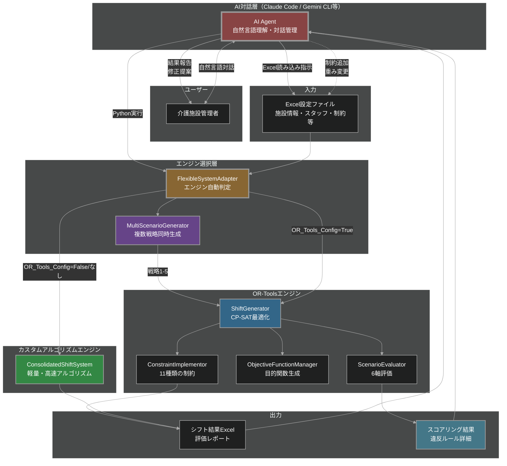

**ポイント**:
- AI層が自然言語を理解してPython実行
- 2つのエンジン（OR-Tools/カスタム）を自動選択
- 複数シナリオ同時生成が可能
- 6軸評価で品質を保証

---

## 2. エンジン自動切り替えフロー

**概要**: OR-Toolsエンジンとカスタムアルゴリズムの選択ロジック

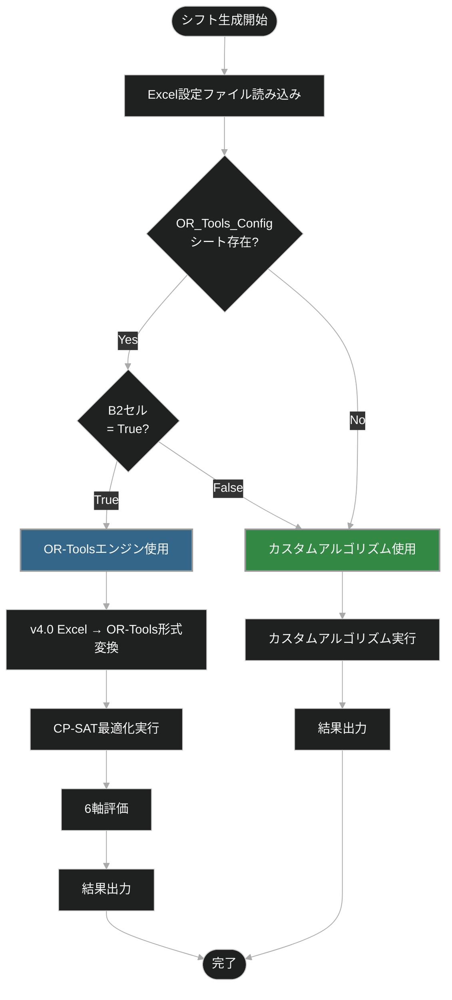

**判定ロジック**:
1. `OR_Tools_Config`シートが存在するか？
2. B2セルが`True`か？
3. Yes → OR-Tools、No → カスタムアルゴリズム

---

## 3. OR-Toolsエンジン詳細アーキテクチャ

**概要**: OR-Toolsエンジンの内部構造と11種類の制約

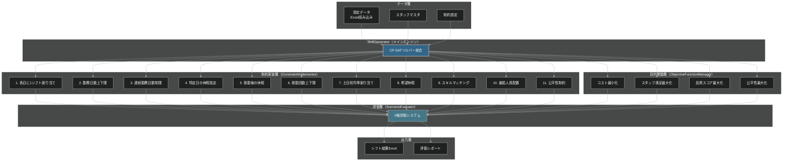

**11種類の制約詳細**:
1. 各日に1シフト割り当て（必須）
2. 月間勤務日数の上下限
3. 連続勤務日数制限（例: 5連勤まで）
4. 特定日の休暇指定
5. 夜勤後は翌日休み
6. 夜勤回数の上下限
7. 土日祝日の均等割り当て
8. 希望休暇の考慮
9. スキルマッチング（資格要件）
10. 最低人員配置（シフトタイプごと）
11. 公平性（経験値差の最小化）

---

# コア機能

## 4. マルチシナリオ生成フロー

**概要**: 5つの最適化戦略で同時にシナリオ生成

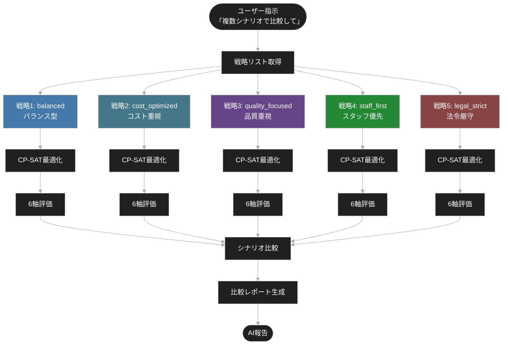

**使用例**:
```python
result = auto_generate_shift(
    'config.xlsx', 2025, 1,
    strategies=['balanced', 'cost_optimized', 'quality_focused']
)
# → 3シナリオ生成して比較
```

---

## 5. データフロー図（Excel → 出力）

**概要**: データの変換フロー全体像

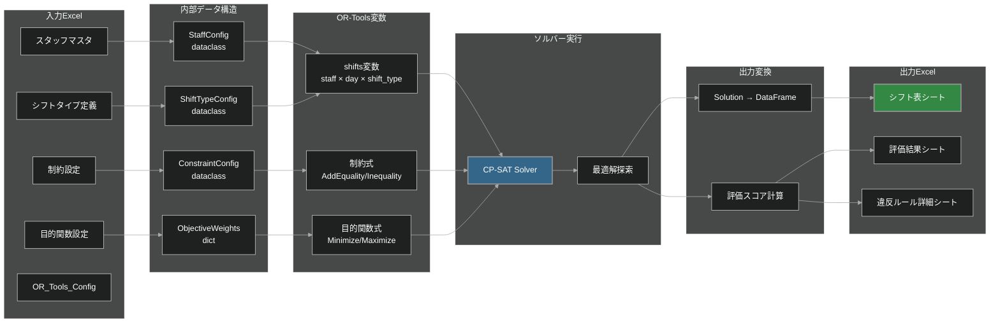

**データ変換の流れ**:
1. Excel読み込み → dataclass変換
2. dataclass → OR-Tools変数・制約式
3. ソルバー実行 → 最適解取得
4. 最適解 → DataFrame変換
5. DataFrame → Excel出力

---

## 6. コンポーネント関係図

**概要**: モジュール間の依存関係

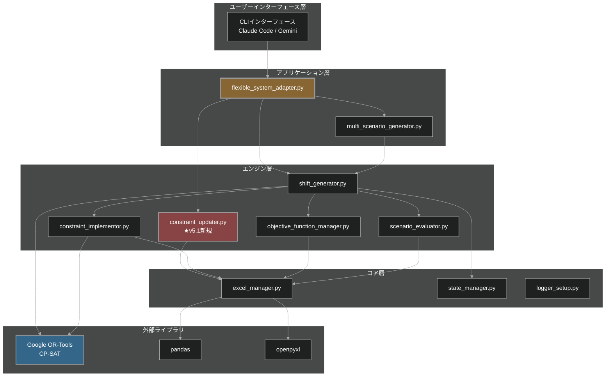

**依存関係の階層**:
1. CLI層 → アプリケーション層
2. アプリケーション層 → エンジン層
3. エンジン層 → コア層
4. コア層 → 外部ライブラリ

---

## 7. 戦略別重み調整マトリクス

**概要**: 5つの最適化戦略の目的関数重み比較

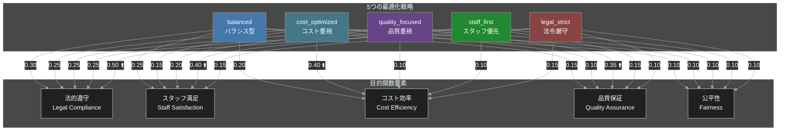

**重みマトリクス表**:

| 戦略 | 法的遵守 | スタッフ満足 | コスト効率 | 品質保証 | 公平性 |
|------|---------|------------|-----------|---------|-------|
| balanced | 0.30 | 0.25 | 0.20 | 0.15 | 0.10 |
| cost_optimized | 0.25 | 0.15 | **0.40** ⬆️ | 0.10 | 0.10 |
| quality_focused | 0.25 | 0.20 | 0.10 | **0.35** ⬆️ | 0.10 |
| staff_first | 0.25 | **0.40** ⬆️ | 0.10 | 0.15 | 0.10 |
| legal_strict | **0.50** ⬆️ | 0.15 | 0.15 | 0.10 | 0.10 |

---

## 8. 6軸評価システム

**概要**: 生成されたシフトの品質を6つの軸で評価

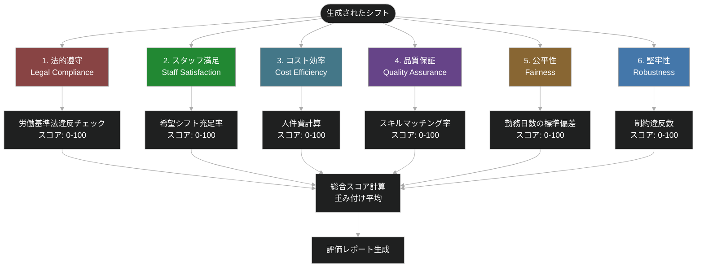

**6軸評価詳細**:
1. **法的遵守**: 労働基準法違反の有無（週40時間、月60時間残業など）
2. **スタッフ満足**: 希望休暇・希望シフトの充足率
3. **コスト効率**: 人件費の最小化（正職員/パート比率最適化）
4. **品質保証**: スキルマッチング率、資格要件の充足
5. **公平性**: 勤務日数・夜勤回数の偏り最小化
6. **堅牢性**: 制約違反数（少ないほど良い）

---

# 運用・テスト

## 9. テストアーキテクチャ

**概要**: ユニットテスト、統合テストの構成

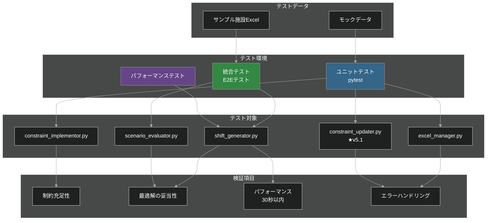

**テスト戦略**:
- **ユニットテスト**: 各モジュールの関数単位でテスト
- **統合テスト**: Excel入力→シフト出力の完全フロー
- **パフォーマンステスト**: 30秒以内の完了を保証

---

## 10. デプロイメント構成（シンプル版）

**概要**: ローカル実行とサーバー実行の構成

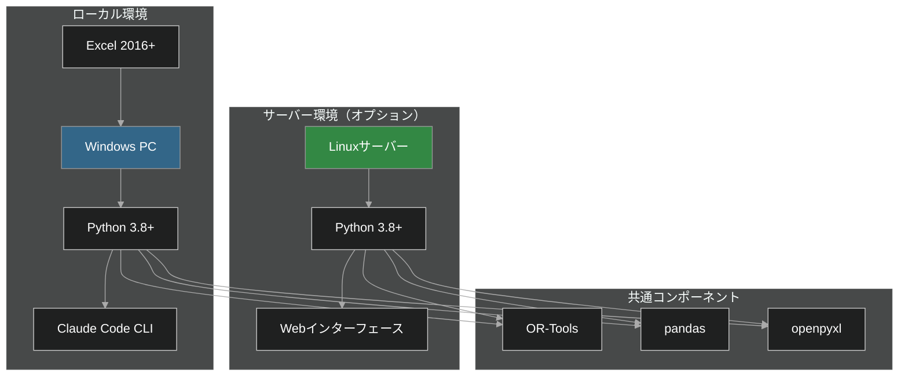

**デプロイ方法**:
- **ローカル**: Windows PC + Python + Claude Code
- **サーバー**: Linux + Python + Webインターフェース（将来実装）

---

# AI連携

## 11. 対話ループフロー（AI連携）

**概要**: ユーザーとAIの対話によるシフト改善フロー

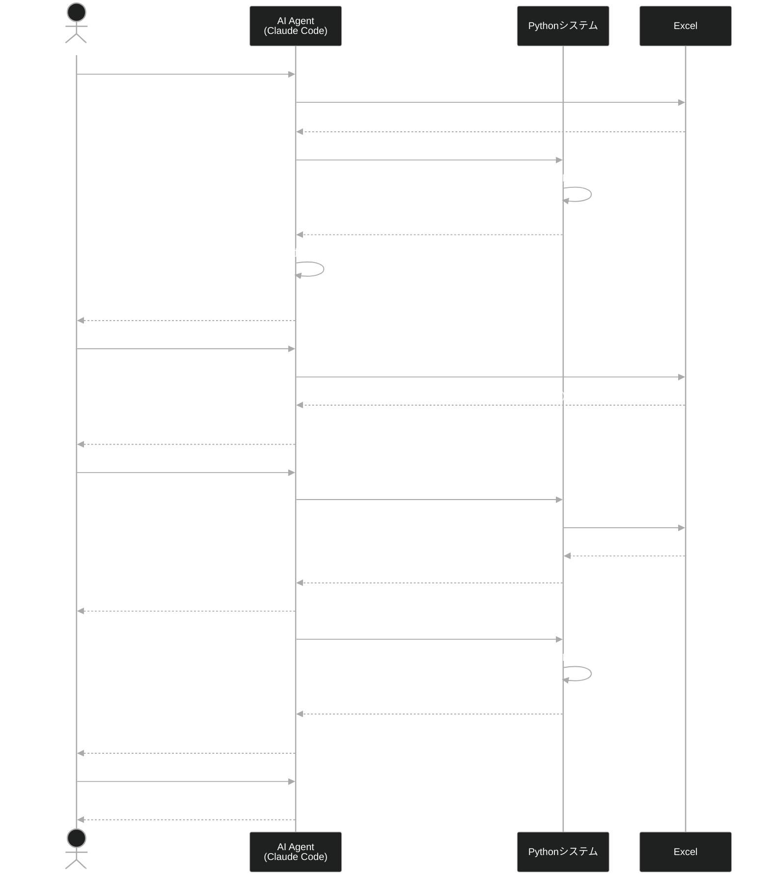

**対話フロー**:
1. ユーザーが自然言語で指示
2. AIが理解してPython実行
3. 結果を日本語で報告
4. ユーザーが修正依頼
5. AIが制約追加して再生成
6. 繰り返し改善

---

## 12. AI-システム責任分担図

**概要**: AI層とPythonシステム層の責任分界

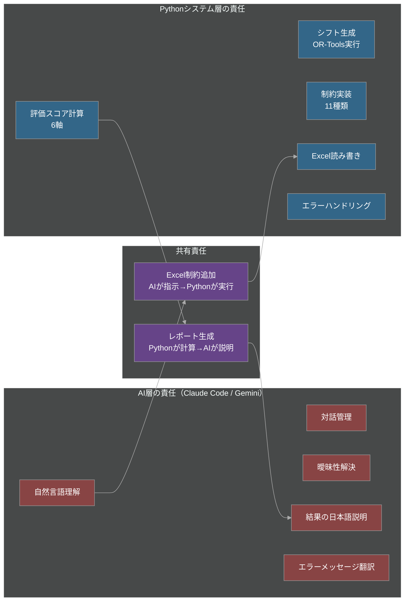

**責任分担**:

| 責任 | AI層 | Python層 |
|------|------|----------|
| 自然言語理解 | ✅ | - |
| 対話管理 | ✅ | - |
| 曖昧性解決 | ✅ | - |
| シフト生成 | - | ✅ |
| 制約実装 | - | ✅ |
| 評価計算 | - | ✅ |
| Excel操作 | ✅ (指示) | ✅ (実行) |
| レポート生成 | ✅ (説明) | ✅ (計算) |

---

# モード管理 v5.1

## 13. モードベースアクセス制御フロー

**概要**: Production/Test/Debugモードによる実行制御

```mermaid
%%{init: {'theme':'dark', 'themeVariables': {'primaryTextColor':'#fff','secondaryTextColor':'#fff','tertiaryTextColor':'#fff','textColor':'#fff','primaryBorderColor':'#aaa','secondaryBorderColor':'#aaa','lineColor':'#aaa','edgeLabelBackground':'#333'}}}%%
flowchart TD
    Start([AI実行開始]) --> CheckMode{現在のモード確認<br/>.ai_mode}

    CheckMode -->|production| ProdMode[🔴 本番モード]
    CheckMode -->|test| TestMode[🟡 テストモード]
    CheckMode -->|debug| DebugMode[🟢 デバッグモード]

    ProdMode --> ClassifyReq{要求タイプ判定}
    TestMode --> ClassifyReq
    DebugMode --> ClassifyReq

    ClassifyReq -->|ホワイトリスト関数| WhitelistCheck{権限チェック}
    ClassifyReq -->|新規スクリプト| NewScriptCheck{権限チェック}
    ClassifyReq -->|OR-Tools直接| DirectORCheck{権限チェック}

    WhitelistCheck -->|production| AllowWL[✅ 実行許可]
    WhitelistCheck -->|test| AllowWL
    WhitelistCheck -->|debug| AllowWL

    NewScriptCheck -->|production| DenyNew[❌ 実行拒否<br/>本番モードでは禁止]
    NewScriptCheck -->|test| ConfirmNew[⚠️ ユーザー確認必須<br/>「この新規スクリプトを実行しますか？」]
    NewScriptCheck -->|debug| AllowNew[✅ 自由に実行]

    DirectORCheck -->|production| DenyOR[❌ 実行拒否<br/>auto_generate_shift()を使用]
    DirectORCheck -->|test| ConfirmOR[⚠️ ユーザー確認必須]
    DirectORCheck -->|debug| AllowOR[✅ 自由に実行]

    AllowWL --> Execute[スクリプト実行]
    AllowNew --> Execute
    AllowOR --> Execute

    ConfirmNew -->|Yes| Execute
    ConfirmNew -->|No| Cancel[❌ 実行キャンセル]

    ConfirmOR -->|Yes| Execute
    ConfirmOR -->|No| Cancel

    DenyNew --> Suggest[代替方法提案<br/>「テストモードに切り替えてください」]
    DenyOR --> Suggest

    Execute --> End([完了])
    Cancel --> End
    Suggest --> End

    style ProdMode fill:#884444,stroke:#999,stroke-width:3px
    style TestMode fill:#886633,stroke:#999,stroke-width:3px
    style DebugMode fill:#338844,stroke:#999,stroke-width:3px
```

**モード別動作**:
- **🔴 Production**: ホワイトリストのみ、新規スクリプト禁止
- **🟡 Test**: ユーザー確認で新規スクリプト許可
- **🟢 Debug**: すべて許可、開発用

---

## 14. モード別権限マトリクス

**概要**: 各モードでの操作権限一覧

```mermaid
%%{init: {'theme':'dark', 'themeVariables': {'primaryTextColor':'#fff','secondaryTextColor':'#fff','tertiaryTextColor':'#fff','textColor':'#fff','primaryBorderColor':'#aaa','secondaryBorderColor':'#aaa','lineColor':'#aaa','edgeLabelBackground':'#333'}}}%%
graph TB
    subgraph "操作タイプ"
        OP1[ホワイトリスト関数<br/>auto_generate_shift等]
        OP2[新規スクリプト作成]
        OP3[OR-Tools直接使用]
        OP4[Excel直接操作<br/>openpyxl]
        OP5[ファイルシステム操作]
    end

    subgraph "Production（本番）"
        P1[✅ 許可]
        P2[❌ 禁止]
        P3[❌ 禁止]
        P4[❌ 禁止]
        P5[❌ 禁止]
    end

    subgraph "Test（テスト）"
        T1[✅ 許可]
        T2[⚠️ 確認必須]
        T3[⚠️ 確認必須]
        T4[⚠️ 確認必須]
        T5[⚠️ 確認必須]
    end

    subgraph "Debug（デバッグ）"
        D1[✅ 許可]
        D2[✅ 許可]
        D3[✅ 許可]
        D4[✅ 許可]
        D5[✅ 許可]
    end

    OP1 --> P1
    OP1 --> T1
    OP1 --> D1

    OP2 --> P2
    OP2 --> T2
    OP2 --> D2

    OP3 --> P3
    OP3 --> T3
    OP3 --> D3

    OP4 --> P4
    OP4 --> T4
    OP4 --> D4

    OP5 --> P5
    OP5 --> T5
    OP5 --> D5

    style P1 fill:#338844,stroke:#999
    style P2 fill:#884444,stroke:#999
    style P3 fill:#884444,stroke:#999
    style P4 fill:#884444,stroke:#999
    style P5 fill:#884444,stroke:#999

    style T1 fill:#338844,stroke:#999
    style T2 fill:#886633,stroke:#999
    style T3 fill:#886633,stroke:#999
    style T4 fill:#886633,stroke:#999
    style T5 fill:#886633,stroke:#999

    style D1 fill:#338844,stroke:#999
    style D2 fill:#338844,stroke:#999
    style D3 fill:#338844,stroke:#999
    style D4 fill:#338844,stroke:#999
    style D5 fill:#338844,stroke:#999
```

**権限マトリクス表**:

| 操作タイプ | Production | Test | Debug |
|-----------|-----------|------|-------|
| ホワイトリスト関数 | ✅ | ✅ | ✅ |
| 新規スクリプト作成 | ❌ | ⚠️ | ✅ |
| OR-Tools直接使用 | ❌ | ⚠️ | ✅ |
| Excel直接操作 | ❌ | ⚠️ | ✅ |
| ファイルシステム操作 | ❌ | ⚠️ | ✅ |

**凡例**:
- ✅ 無条件で許可
- ⚠️ ユーザー確認が必要
- ❌ 実行拒否

---

## 15. モード切り替えシーケンス

**概要**: モード切り替えの実行シーケンス詳細

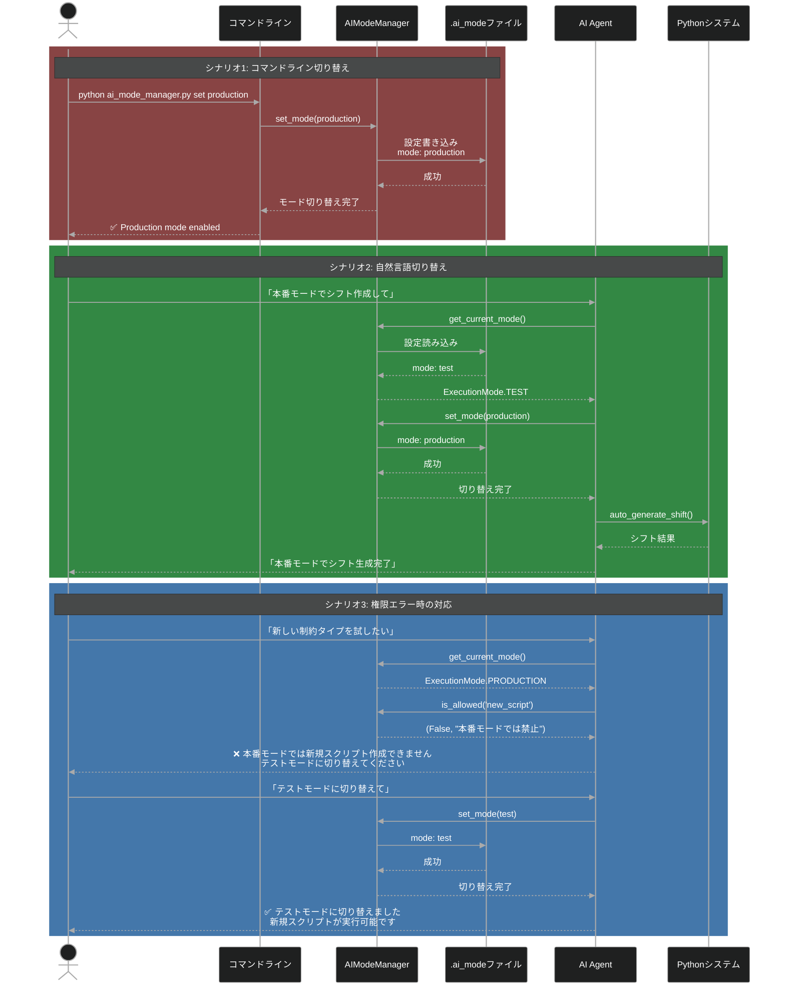

**モード切り替え方法**:
1. **コマンドライン**: `python ai_mode_manager.py set <mode>`
2. **自然言語**: 「本番モードで実行して」
3. **環境変数**: `export AI_EXECUTION_MODE=debug`

---

## 16. 全体アーキテクチャ（モード統合版）

**概要**: モード管理層を含む完全なシステム構成

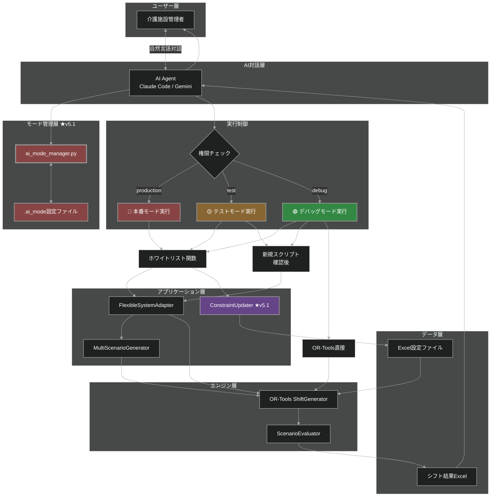

**統合アーキテクチャのポイント**:
1. **モード管理層**がAI実行を制御
2. **3つのモード**で安全性とフレキシビリティを両立
3. **Phase 1 (v5.1)**でConstraintUpdater追加
4. **ホワイトリスト**で本番環境の安全性確保

---

## 📝 まとめ

### システムの特徴

1. **AI駆動**: 自然言語で指示、AIがPython実行
2. **2つのエンジン**: OR-Tools（高度） / カスタム（軽量）
3. **5つの戦略**: balanced, cost_optimized, quality_focused, staff_first, legal_strict
4. **6軸評価**: 法的遵守、スタッフ満足、コスト効率、品質、公平性、堅牢性
5. **11種類の制約**: 労働基準法から公平性まで包括的に対応
6. **モード管理**: Production/Test/Debugで安全性確保

### v5.1での追加機能

- **ConstraintUpdater**: Excel制約を動的追加（5関数）
- **モード管理システム**: AI実行の安全性制御（3モード）
- **対話ループ**: 繰り返し改善フロー

### 次のステップ

- **Phase 2**: 自然言語パーサー実装
- **Phase 3**: 対話状態管理実装

---

**ドキュメント作成**: Claude Code
**バージョン**: v5.1
**最終更新**: 2025-10-01
